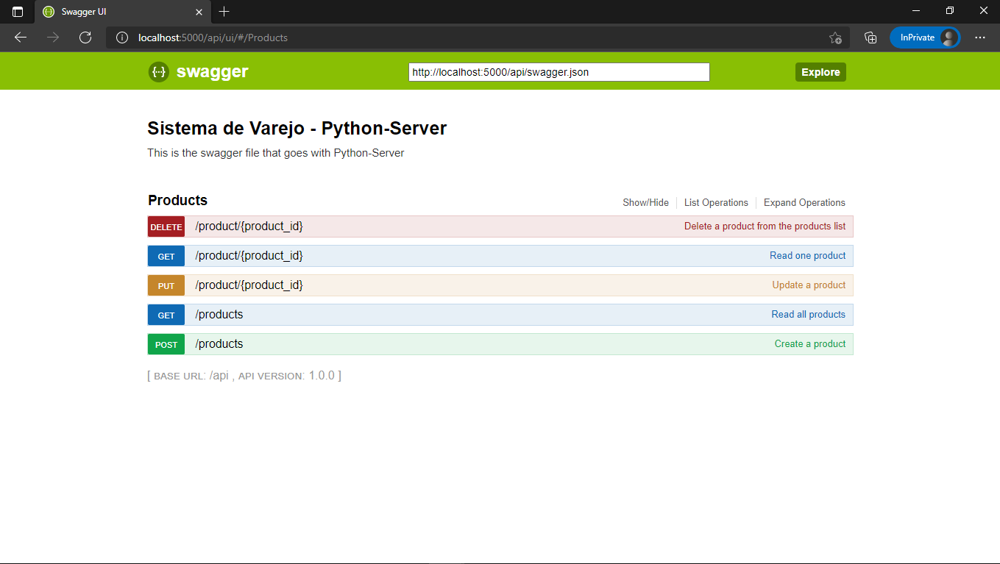
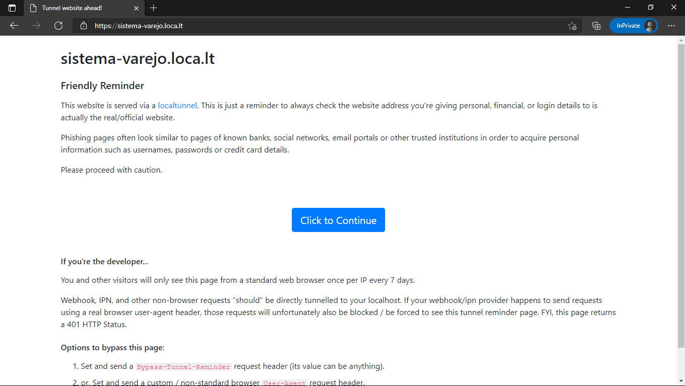
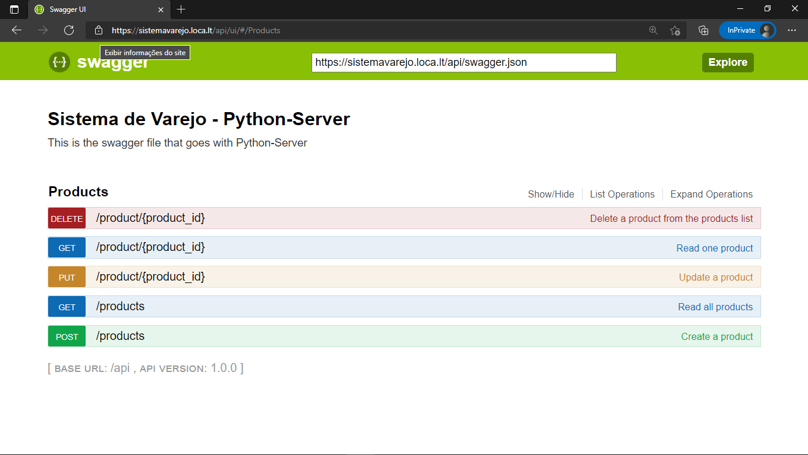

# Sistema de Varejo: Python-Server
 Trabalho de Sistemas Distribuídos (ECO - UNIFEI), Servidor Python do Sistema de Varejo.

## Executando o Servidor Localmente:
- Caso tenha baixado o projeto via GitHub, crie uma virtualenv e importe as bibliotecas do arquivo `requirements.txt` para ela.
  + O arquivo .zip enviado diretamente pelo autor não necessita dessa etapa
### Acessando o Virtual Env e Iniciando o Servidor:
- Abra o console (VSCode ou CLI de escolha) e acesse a pasta ".\Python-Server\";
  + No VSCode, execute o comando `venv\Scripts\Activate.ps1` para ativar o Virtual Env;
  + No CMD do Windows, execute o comando `venv\Scripts\activate` para ativar o Virtual Env;
- Feito isso, execute o arquivo `.\Python-Server\flaskr\server.py` para iniciar o servidor;

### Interfaces do Servidor:
- Por padrão, o servidor é iniciado no endereço "http://localhost:5000/";
- Para acessar a interface do Swagger, que lista as chamadas da API, acesse o endereço "http://localhost:5000/api/ui";

## Executando o Servidor Remotamente (via LocalTunnel):
- Inicialmente, siga todos os passos anteriores para iniciar uma execução do servidor de forma local;
- Em uma nova aba do CLI, faça o download do LocalTunnel via npm através do comando:

`npm install -g localtunnel`

- Feita a instalação, é possível criar um subdomínio para a API através do CLI utilizando o comando:

`lt --port 5000 --subdomain sistemavarejo`

- O subdomínio criado será "https://sistemavarejo.loca.lt", através do qual será possível acessar a API de outras máquinas;
- Inicialmente, uma interface como essa irá aparecer. Basta selecionar "Click to Continue" para acessar a homepage do servidor;

- Assim, para acessar a interface do Swagger da máquina remota, basta acessar o endereço "https://sistemavarejo.loca.lt/api/ui"

